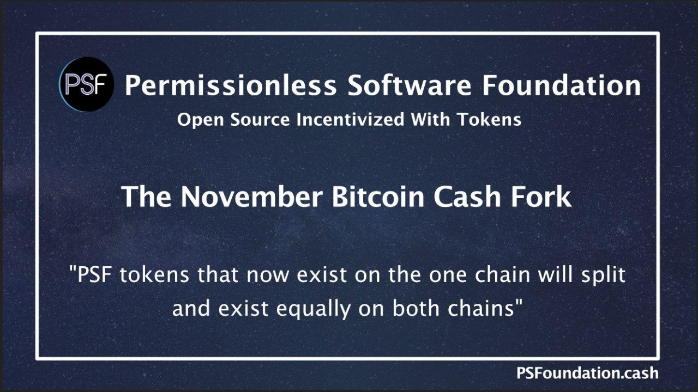

Several PSF members have been asking about the potential chain split of the BCH blockchain on November 15th. This article will walk through the actions [FullStack.cash](https://fullstack.cash) is taking with its infrastructure, and that [PSF](https://psfoundation.cash) will be taking with its token, in order to mitigate risk, and support the developers and businesses that use our software.

## Will There Be a Fork?
Many people in the BCH network are wrestling with the concept of the fork. Some are still questioning if there will even be a fork or not.

ABC has been very clear on their stance, and they plan to move forward regardless of community support. The vast majority of BCH social media appear unwilling to accept the new coinbase rule. Most of the developers behind other full node implementations have also come out against it.

Ultimately the decision to split will come down to the miners. In order for miners running the BCHN full node software to split the chain, they’ll need to mine 10 blocks ahead of the ABC chain. There appears to be enough hash power signaling in support of BCHN to accomplish a split. It’s unknown who would end up with the ticker symbol. It's a fluid situation, and it will not be resolved until after November 15th. It may take a very long time for the BCHN chain to achieve the needed proof of work. It could happen quickly, or it might not happen at all.

Even if BCHN manages to split the chain, they'll need to maintain the 10-block advance on the ABC chain. Otherwise SPV wallets, as well as BCHN nodes exiting and entering the network, will flip back-and-forth between chains. It could get very messy. But ABC nodes will not be exposed to this risk, and by extension, neither will the [FullStack.cash](https://fullstack.cash) Cash Stack.

## How will FullStack.cash and PSF handle the fork?
The Permissionless Software Foundation embraces the concept of forks. As laid out in [the business plan](https://psfoundation.cash/biz-plan/business-plan#migitatingFailure), forks are an important governance tool for mitigating catastrophic failures. Since the looming split centers around governance and not technical changes, FullStack.cash infrastructure can run on both chains without any changes.

A month prior to the fork, a mirror of the existing FullStack.cash [CashStrap](https://fullstack.cash/cashstrap) infrastructure will be created, using BCHN as the base of the [Cash Stack](https://fullstack.cash). The BCHN-based REST API will appear at bchn.fullstack.cash. You’ll be able to point [the bch-js npm library](https://www.npmjs.com/package/@psf/bch-js) at it by setting the `restURL` when instantiating the library. By default, bch-js will use the ABC chain, but switching to the BCHN chain will only require a one-line code change.

How does the split effect the PSF token?
In the event of a chain split, all PSF tokens that now exist on the one chain will split and exist equally on both chains. The BCH in the token-liquidity app will also split and exist on each chain.

In the event of a chain split, the PSF plans to execute the following plan:

1. The token-liquidity app will be stopped temporarily. The stop will be announced on the [PSF Twitter](https://twitter.com/PSF_DAO) feed as well as the [PSF Telegram](https://t.me/permissionless_software) channel.  

2. The BCHN-chain coins and tokens will be split into a separate wallet. Then the token-liquidity app on the ABC-chain will be brought back online. It is hoped this step can be accomplished quickly. When the token-liquidity app is back online, on the ABC-chain, it will be announced on Twitter and Telegram.  

3. We will fork wallet.fullstack.cash to create a web wallet for the BCHN-chain. The address will be bchn.wallet.fullstack.cash. This will allow people to easily split their BCH and SLP tokens. We will post step-by-step directions on YouTube.  

4. A new token-liquidity app on the BCHN-chain will be started. It will be funded with the coins and tokens split from the original app. Once online, the addresses for this new app will be posted to [the PSF website](https://PSFoundation.cash/), as well as Twitter and Telegram.  

5. A new app will be developed that allows the transfer of PSF tokens between chains. There will be two parts to it:

    - We will create an app similar to the token-liquidity app that receives PSF tokens on one chain and sends out PSF tokens on the other chain.

    - We will create a fork of [wallet.fullstack.cash](https://wallet.fullstack.cash/) that will accept PSF tokens from both chains. This will be the user interface for exchanging tokens between chains.

The first four parts of the plan will happen very rapidly. The last step (5) will take time to develop. It might take a couple weeks.

## How does this effect PSF funding/governance?
The next funding-token air-drop for [grant funding](https://psfoundation.cash/grants/) will take place on October 15th. Those funding tokens are expected to be sent to new grants by November 1st. The next funding/governance round will be completed well before the chain could split.

Because tokens will need to be split and shuffled after the fork, the staking requirement may be adjusted for the following funding/governance round.

## Why are we using ABC chain as the default?
ABC has a proven track record of creating reliable full node software. As contentious as the Infrastructure Funding Plan (IFP) is, the significant increase in funding for maintenance and the road map can only help them continue to deliver steady improvements.

BCHN has many talented and dedicated developers. But they do not have a track record of working as a team, producing bug-limited software, or applying rigorous quality assurance to the software they produce.

Here are a few resources that shaped our decision:

- Joannes Vermorel is a tech auditor, and in this video he compares the different full node implementations:
  - https://youtu.be/ZIhQnfAk8AU?t=9968

- More recently, he published this review of BCHN:
  - https://blog.vermorel.com/journal/2020/8/24/empirical-insights-on-bchn.html

- C. Edward Kelso captures the current culture, tough choices, and careful consideration in choosing between forks:
  - https://read.cash/@CoinFugazi/supporting-the-new-bitcoin-cash-coinbase-rule-4fc3a6c6

## How to stay up to date
The Permissionless Software Foundation will continue to monitor the evolving situation around the chain split. We will maintain these communication channels with information:

- [PSF Telegram Channel](https://t.me/permissionless_software)
- [PSF Twitter](https://twitter.com/PSF_DAO)
- [PSF Blog](https://psfoundation.cash/blog)
