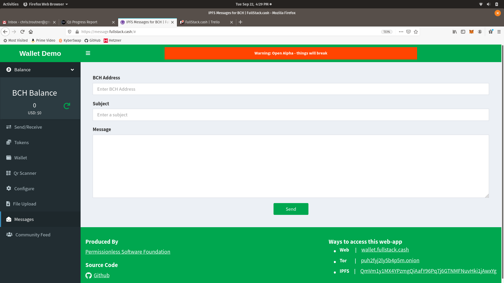
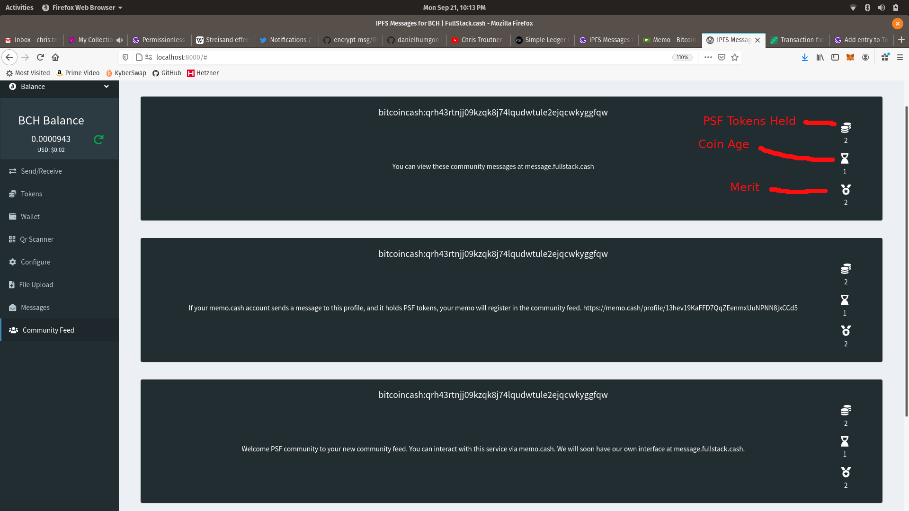
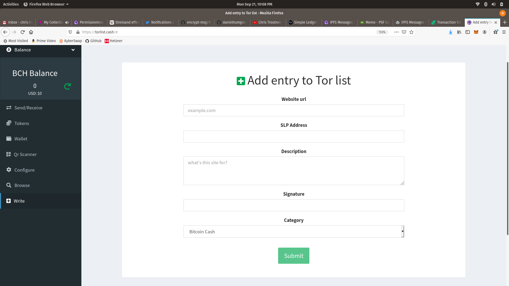

Now that the Permissionless Software Foundation is about half way through its first quarter of grants, it’s a good time to present current progress and celebrate our incredible success. The PSF community had a greater than 90% participation rate in the last governance round of grant funding. Top quality developers answered the call and have been fulfilling [bounties](https://github.com/Permissionless-Software-Foundation/bounties). They have clearly appreciated the incentives the PSF community created for them. So far, we have seen success on every front of the Permissionless Software Foundation vision, laid out in [the business plan](https://psfoundation.cash/biz-plan/business-plan).

The summaries below are condensed for the sake of brevity. If they pique your interest, we invite you to [join our Telegram Channel](https://t.me/permissionless_software) and ask for additional information.

## BCH Dev Con III
During September 4th-6th 2020, the PSF and [FullStack.cash](https://fullstack.cash) were proud sponsors of the [Third Bitcoin Cash Dev Con](https://devcon.cash). [Chris Troutner](https://github.com/christroutner?tab=repositories), our ‘Head Janitor’, mentored contestants and helped to judge the 16 teams that competed. Innovative new ideas were born, and new developers were onboarded into the Bitcoin Cash world, with [FullStack.cash](https://fullstack.cash) as their bridge into that new world. Not only did we help and support the Bitcoin Cash developer community, [FullStack.cash](https://fullstack.cash) gained prominent mindshare with the developers and companies participating in, and watching, the hackathon.

- [Contest wrap-up video](https://lbry.tv/@BitcoinCashSite:6/BCHDevCon3FinalPresentations:9)
- [Dev Con III Overview](https://read.cash/@SatoshisAngels/bchdevconiii-recap-6a1b5902)

## wallet.fullstack.cash
[FullStack.cash](https://fullstack.cash) is the flagship product for the Permissionless Software Foundation. The more users who use [bch-js and bch-api](https://fullstack.cash/documentation), the more subscriptions will be sold, and the more PSF tokens will be burned, making the tokens held by developers and community members increase in value. But developer tools like bch-js and bch-api are a means to an end, not the end in themselves.

The end, which developers use our tools to achieve, is apps. Apps like [wallet.fullstack.cash](https://wallet.fullstack.cash).

This web wallet application is 100% open source and MIT licensed, allowing companies to easily white-label it. We have already forked it several times for other projects, presented in this post. It's the only Bitcoin Cash web-wallet that has full support for nonfugible (NFT) tokens.

By default, the code includes a 2,000 satoshi convenience fee output added to each transaction (about $0.005 USD). These 2,000 sats go to burn PSF tokens.

[Nicolas Cappabianca](https://github.com/Nicocappabianca) has been making steady improvements to the wallet, moving it from the current Alpha release to a more stable Beta release soon.

### SLP Post Office
We have a working copy of the [SLP Post Office server](https://github.com/Permissionless-Software-Foundation/simpleledger-post-office-server) developed by [alcipir](https://github.com/alcipir), and a [web wallet plugin](https://github.com/Permissionless-Software-Foundation/bch-wallet-plugin-postoffice) implemented into [wallet.fullstack.cash](https://wallet.fullstack.cash). [This YouTube video](https://youtu.be/vtv9bAQx5LE) demonstrates the use of [wallet.fullstack.cash](https://wallet.fullstack.cash) to send PSF tokens without BCH in the wallet. This greatly lowers the friction for onboarding new users to SLP tokens. As [wallet.fullstack.cash](https://wallet.fullstack.cash) matures, we’ll expand the number of tokens that can be used to pay for postage. [davecy](https://github.com/davecy) has been increasing the test coverage for the Post Office server.

### Paper Wallet Sweeping
Quickly, easily, and safely storing SLP tokens onto paper wallets allows easy onboarding of new users into the cryptocurrency space. The crypto-currious can easily purchase and hold tokens using [paper wallets](https://slp-paper-wallet.fullstack.cash/) (as well as [inexpensive and durable laser-etch plastic wallets](https://youtu.be/g7G-TZ7fW2s)).

An organization in Australia has sponsored the PSF to develop and implement the sweeping of paper wallets. This feature will soon appear at [wallet.fullstack.cash](https://wallet.fullstack.cash). We will also fork the web wallet and customize it for that organization. To date, it’s been our most successful [sponsorship](https://fullstack.cash/consulting). Sponsorship funds go to burn PSF tokens. We are looking for additional organizations who's interests align with our own.

## message.fullstack.cash
[Daniel Gonzalez](https://github.com/danielhumgon) has been heading up the development of [message.fullstack.cash](https://message.fullstack.cash/). It is a fork of wallet.fullstack.cash. This will be a web-app implementation of the powerful [encrypt-msg](https://github.com/Permissionless-Software-Foundation/encrypt-msg/blob/master/docs/README.md) command-line app that allows anyone to send end-to-end (e2e) encrypted messages and files to anyone else in the world, in a way that is both uncensorable and tamper-proof. The user experience will be similar to web-based email. User fees of about $0.01 per message will go to burn PSF tokens. He is very close to having a working prototype.

Message.fullstack.cash also gives the PSF community a voice. Using the same protocol as memo.cash, the Community Feed View will allow stakeholders in the PSF community to display their PSF token holdings when sending messages to the PSF community channel (a Bitcoin Cash address). At a glance, community members can quantify the economic ‘power’ behind a message sent to the community. This communication tool in intended to facilitate communication and coordination between significant economic stakeholders within the PSF community.

## torlist.cash
As per [the business plan](https://psfoundation.cash/biz-plan/business-plan#searchEngine), the [torlist.cash](https://torlist.cash) website is a deep-web focused curated list. It uses the [OrbitDB](https://orbitdb.org/) peer-to-peer database that runs on top of IPFS. Torlist.cash will put [Tor](https://www.torproject.org/), [IPFS](https://ipfs.io/), and other deep-web-based websites on equal footing with .com clear-net websites. The use of OrbitDB ensures the list can leverage the [Streisand effect](https://en.wikipedia.org/wiki/Streisand_effect) if censorship of the list is ever attempted.

[Gary Nadir](https://github.com/MezzMar) is heading up development of this fork of wallet.fullstack.cash. Users will be able to add their website address to a category, along with a description. Their ranking within the category will depend on a combination of community rankings and an amount of PSF tokens staked. This will increase demand for the PSF token.

## Collaborative CoinJoin
[Stoyan Zhekov](https://github.com/zh) did some amazing research into collaborative transactions and helped add [two new examples to the bch-js-examples repository](https://github.com/Permissionless-Software-Foundation/bch-js-examples/tree/master/applications/collaborate). Not only are these examples applicable to a wide-range of business problems, they pave the way for a CoinJoin protocol that can be implemented into [slp-cli-wallet](https://youtu.be/Rsld45WcFUI?t=2175). A protocol is being developed right now, which will be implemented next quarter. This protocol will provide another CoinJoin-based financial-privacy protocol like CashShuffle and CashFusion, which will allow wallets to achieve fungible cash-like privacy.

## Solving the Adoption Chicken-and-Egg Problem
A final success worth celebrating is the clear evidence that the Permissionless Software Foundation has cracked the chicken-and-egg problem of adoption. [Gary Nadir](https://github.com/MezzMar) and [Daniel Gonzalez](https://github.com/danielhumgon) are both located in Venezuela. [Nicolas Cappabianca](https://github.com/Nicocappabianca) is located in Argentina. The bounties they collect in PSF tokens are being converted into BCH and spent locally within their repressed economies. Through their own self interest, they are spending BCH and fostering adoption in parts of the world where cryptocurrency can make the biggest impact. They are learning new, valuable, marketable skills, and the PSF community is directly benefiting from their hard work. We have established a positive-feedback loop where every actor benefits.

## Looking Forward
As we look forward to the next [governance funding round](/grants) in November, the PSF community is anxious to continue riding our wave of success. Several software projects that will directly increase demand for PSF tokens are on the verge of being ready for open Alpha testing. All of these projects enhance individual freedom, and enable more adoption and business use of cryptocurrencies.

If you would like to learn more about the Permissionless Software Foundation, please [join our Telegram Channel](https://t.me/permissionless_software) and ask for additional information.
