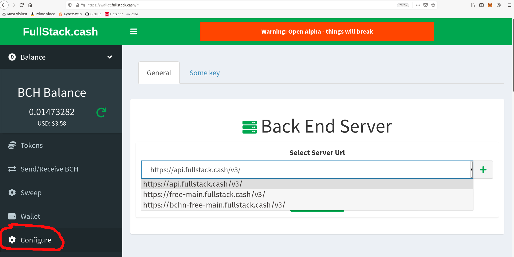

[wallet.fullstack.cash](https://wallet.fullstack.cash) is the white-label-ready Bitcoin Cash (BCH) and SLP token web-wallet. It showcases a 100% open source, MIT-licensed, turn-key wallet app that runs on top of [FullStack.cash](https://fullstack.cash) infrastructure. Any device that can access a web page, can act as a Bitcoin Cash and SLP token wallet.

It's still in early 'Alpha' release, but we've recently released several new features that you should know about.

##  Paper Wallet Sweeping for SLP Tokens
[wallet.fullstack.cash](https://wallet.fullstack.cash) is the first web wallet capable of storing and retrieving SLP tokens from a paper wallet. This is an easy, inexpensive way to store SLP tokens or to give them away to others. The first step is generating a paper wallet:

- Generate a paper wallet for SLP tokens at [slp-paper-wallet.fullstack.cash](https://slp-paper-wallet.fullstack.cash)
- Generate a paper wallet for BCH at [paperwallet.bitcoin.com](https://paperwallet.bitcoin.com)

We've also published a video introducing paper wallets and the different apps available or working with them:

<iframe width="560" height="315" src="https://www.youtube.com/embed/e1JxSirCiXM" frameborder="0" allow="accelerometer; autoplay; clipboard-write; encrypted-media; gyroscope; picture-in-picture" allowfullscreen></iframe>

## Tor Support
The PSF [community of developers](https://psfoundation.cash/grants) is proud to announce that [wallet.fullstack.cash](https://wallet.fullstack.cash) is available over Tor (the onion router). Using [Tor Browser](https://www.torproject.org/download/) or [Brave Browser's Private Window with Tor](https://support.brave.com/hc/en-us/articles/360018121491-What-is-a-Private-Window-with-Tor-), you can privately access the wallet at the following URL:

- http://puh2fyj2ly5b4p5m.onion/

## Wallet support for both ABC and BCHN Chains
November 15th is shaping up to be a fairly amicable chain split into two new blockchains. [As we announced](/blog/november-fork), the Permissionless Software Foundation will support both chains and welcomes the opportunity to serve two markets.

- [wallet.fullstack.cash](https://wallet.fullstack.cash) will default to the ABC chain.
- [bchn-wallet.fullstack.cash](https://bchn-wallet.fullstak.cash) will default to the BCHN chain.

The Gatsby Theme that powers both wallets, [gatsby-ipfs-web-wallet](https://github.com/Permissionless-Software-Foundation/gatsby-ipfs-web-wallet), is easily configurable for either chain. Users can choose a chain prior to creating a new wallet, using a drop-down selector in the Configuration View. Once the wallet is created, the server and blockchain will be saved with the wallet data.

- api.fullstack.cash - is the default server for [wallet.fullstack.cash](https://wallet.fullstack.cash). This is the premium blockchain service following the ABC chain.
- free-main.fullstack.cash is the free blockchain service following the ABC chain.
- bchn-free-main.fullstack.cash is the default server for [bchn-wallet.fullstack.cash](https://bchn-wallet.fullstak.cash). This is a free blockchain service following the BCHN chain.

The **free** servers provide rate-limited access to blockchain services. The rate limits are adaquate for most web wallet users, though throttling may occur for wallets will a large number of SLP tokens. The **premium** blockchain service is available for $30 per month through [FullStack.cash](https://fullstack.cash) for businesses that want to customize the web wallet for their own use, or build other Bitcoin Cash based web apps. [Custom infrastructure](https://fullstack.cash/pricing) following either the ABC or BCHN chain is also available.

## Coin Splitting is Coming
Now that infrastructure is in place to support both chains, PSF developers are working hard on creating a coin-splitting tool. This web app will allow users to easily split their BCH and SLP tokens between chains.

The coin-splitting tool will make use of the new paper wallet sweeping feature in [wallet.fullstack.cash](https://wallet.fullstack.cash). Any coins and tokens saved to a paper wallet **before** the chain split, will be able to be scanned by this tool **after** the chain split. The BCH will safely be split and deposited into addresses on each chain. The addresses will be specified by the user prior to scanning the QR code.

The web wallets on each chain will provide an easy way for users to create wallets on each chain. After splitting, coins and tokens can be deposited back into cold storage via a paper wallet or other method.
