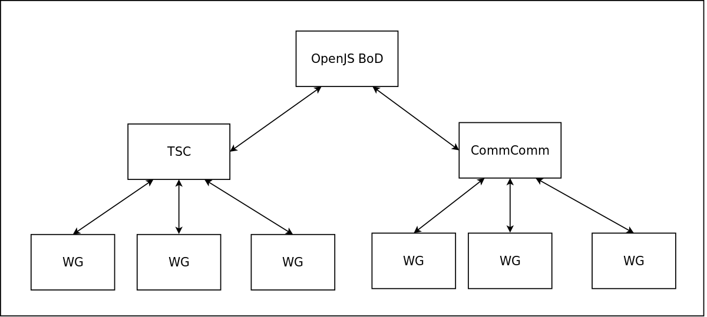
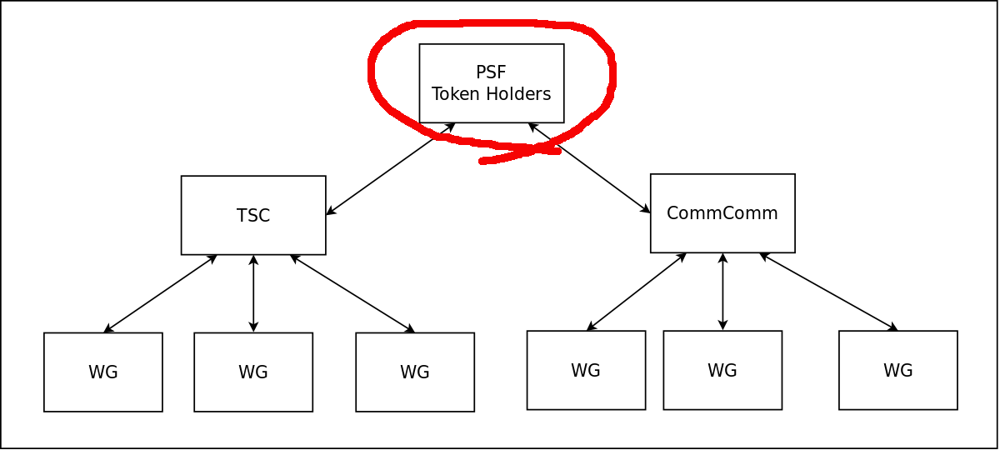

*TL;DR: The Permissionless Software Foundation is evolving its governance structure. This article discusses the things that are changing, why they are changing, and why you should care. This is an excellent time for you to [join our Telegram channel](https://t.me/permissionless_software) and help steer the direction of the organization.*

The [Permissionless Software Foundation](https://psfoundation.cash) (PSF) is changing it's governance structure to reflect lessons learned from two great sources of inspiration:

- The title of this post is adapted from [Mikeal Rogers](https://github.com/mikeal) article, [Healthy Open Source](https://medium.com/the-node-js-collection/healthy-open-source-967fa8be7951). That article describes the [Node.js Foundation governance](https://nodejs.org/en/about/governance/).  

- [Working in Public](https://amzn.to/3mCVgPV) by [Nadia Eghbal](https://nadiaeghbal.com/) provides ground-breaking insight on how to manage open source projects in a healthy and sustainable way. It points out many common pitfalls and failure modes that cause open source projects to become unhealthy.

We invite participation from Bitcoiners, cryptocurrency enthusiasts, libertarians, and anyone who thinks privacy and free speech are important issues. Our [public Telegram channel](https://t.me/permissionless_software) is a great place to start, but to really have a voice in the new direction of the PSF, you'll need to gain access to [our Telegram VIP channel](https://t.me/psf_vip).

## What's Changing: Governance Architecture
The Node.js governance model was birthed from a fork. When the community didn't like how things were being run by Joyent, they forked node.js to create io.js. The governance model was so successful at growing contributors to the code base that Joyent couldn't compete. They gave the Linux Foundation the rights to Node.js branding, and io.js merged back into node.js. The node.js we know today is a direct result of the success of their governance model. [Here is a brief summary of the history](https://opensource.christmas/2019/13).

Here is what the architecture of their governance looks like:

- There are two primary committees:
  - The Technical Steering Committee (**TSC**), steers the technical decisions of the Foundation.
  - The Community Committee (**CommComm**), acts as the formal 'voice' of the community and is in charge of setting the cultural direction of the Foundation.

- Each of the committees spin off work groups (**WG**) to do the actual work, who report back to the top-level committee during their bi-weekly meetings, which are recorded and broadcast on the [Node.js YouTube channel](https://www.youtube.com/c/nodejs-foundation/videos).
- The two top-level committees ultimately answer to (and are funded by) the OpenJS Board of Directors.

### PSF Token and Governance
The PSF is adapting the above model, so that it looks like this:

The main change is to replace the OpenJS Board of Directors with PSF token holders. Holders of PSF tokens can fund work through the air-drop [grant funding](/grants) mechanism that we've pioneered over the last six months. Significant token holders, with skin-in-the-game, can communicate with one another, and with the top-level committees, via our [VIP Telegram channel](https://t.me/psf_vip).

## Why it's Changing:
The PSF has had [some early success](/blog/q3-progress-report), but growth bottlenecks are becoming obvious. We've been careful to emphasis that everything we're doing is an experiment. We're out on the bleeding edge of blockchain technology, where things often break. We don't engage in the hubris of picking winners or dictating policy. The only concrete thing the organization is committed to is [the PSF mission](https://psfoundation.cash/biz-plan/business-plan#mission):

<i>The mission of the Permissionless Software Foundation is to develop, promote, and maintain software that makes it easy for **individuals** to <u>protect their privacy</u>, <u>circumvent censorship</u>, and <u>engage in economic activity</u>. We believe this is the best way to promote individual sovereignty and increase prosperity. The Foundation will focus on the growth of <u>open source software</u> and the <u>adoption of Bitcoin Cash</u> across the globe, as the primary means of achieving its goals.</i>

The Node.js governance model is simply a *better* way to govern an open source organization like the PSF. Over the last six months, undesirable speculation has largely driven the exchange rate of the token, which can be seen from the rapid increase and then drop of the peg to BCH. This new model lets the token be used as a communication and funding tool, to amplify the signal of economic actors, with skin-in-the-game, who are committed to the PSF mission.

### Creating Clear Communication Channels
In engineering, there is a concept called the '*signal-to-noise ratio*'. It's a measurement of how strong the signal is, relative to the background noise. A low ratio means the signal can not be heard through the noise. A high ratio means the signal can be clearly heard.

Before a community can grow well, it must establish good communication channels. This is why PSF projects have been focused on new communication tools using the PSF token. Tools like [message.FullStack.cash](https://message.fullstack.cash) for sending and receiving end-to-end encrypted (ee2e) messages, and the [VIP Telegram channel](https://t.me/psf_vip).

These tools amplify the signal, and reduce the noise, resulting in a high signal-to-noise ratio. This video discusses the communication channels we've built, and how you can use them to engage with the PSF community.

<iframe width="560" height="315" src="https://www.youtube.com/embed/KOlM4dU6Gj0" frameborder="0" allow="accelerometer; autoplay; clipboard-write; encrypted-media; gyroscope; picture-in-picture" allowfullscreen></iframe>

### Creating a Safe Space
The Bitcoin protocol was created without any governance mechanism to guide its growth. A rag-tag, libertarian-minded community formed around it, using discussion boards, Reddit, and Twitter to communicate. These poor communication mediums led to toxic tribalism and infighting because the loudest voices got the most attention. They had a low signal-to-noise ratio.

After more than a decade of rampant toxic tribalism, [everyone in this space is traumatized](https://nrdgrl007.medium.com/amaury-s%C3%A9chet-on-evolution-governance-religion-bitcoin-cash-beyond-44a7cca98062). Long time veterans of the Bitcoin space tend to be easily emotionally triggered, the same way war veterans are easily triggered by their PTSD. Old wounds are still raw and sore. This trauma must be acknowledged and recognized before it can be healed, before a safe space can be created

Using better communication tools and governance, we can learn from the mistakes of the past. We can begin to build a professional organization where work can be rewarded, and loud, distracting noises can be attenuated. We can increase the signal-to-noise ratio.

One of the benefits of adopting the Node.js model is that we also get to adopt their [Code of Conduct](https://github.com/Permissionless-Software-Foundation/community-committee/blob/master/code-of-conduct.md) and [Moderation Policy](https://github.com/Permissionless-Software-Foundation/community-committee/blob/master/moderation-policy.md). These documents will be used by both the TSC and CommComm, and will be used to create a safe space, with clear guidelines about behavior and moderation. These tools will prevent the toxic tribalism from infecting our community.

### Focus on the Technology, not the Currency
The mission of the PSF is focused on individual empowerment. Blockchains are merely one of many technologies we employ to achieve those goals. With very little modification, our software can run on any of these blockchains:

- BCH
- BCHA
- BSV
- AVAX

While the emphasis has so far been put on the BCH and BCHA chains, we welcome participation from the other blockchains. The [Simple Ledger Protocol](https://github.com/simpleledger/slp-specifications/blob/master/slp-token-type-1.md) (SLP) for tokens is a perfect example of a technology that can easily be deployed to any of the above blockchains. And the community can benefit from wider adoption and participation.

As long as participants are willing to conduct themselves in a professional manner, and are willing to abide by the [Code of Conduct](https://github.com/Permissionless-Software-Foundation/community-committee/blob/master/code-of-conduct.md) and [Moderation Policy](https://github.com/Permissionless-Software-Foundation/community-committee/blob/master/moderation-policy.md), everyone is welcome.

## Why You Should Care
The Bitcoin protocol is one of the best tools for defending the human rights of [privacy](https://en.wikipedia.org/wiki/Right_to_privacy) and [free speech](https://en.wikipedia.org/wiki/Freedom_of_speech). These rights are more important in these times of rampant surveillance and government overreach than ever in history. These rights are being abused by the very organizations that are *supposed* to defend them. But through cryptography, Bitcoin, and other technologies (like [IPFS](https://ipfs.io)), it's possible for individuals to enforce their rights directly.

Blockchain and cryptographic technology has matured enough that it's feasible to form a professional network of businesses building on top of it. Better governance and communication technology can end the toxicity and tribalism that Bitcoin is famous for.

The power is in **your** hands. Add your voice to ours, and together we can speak truth to power. Join our [public Telegram channel](https://t.me/permissionless_software) to start, but to really have a voice in the new direction of the PSF, you'll need to gain access to [our Telegram VIP room](https://t.me/psf_vip). Learn how, by joining the channel and using the `/help` command. More instructions are available in [this YouTube video](https://youtu.be/KOlM4dU6Gj0).
