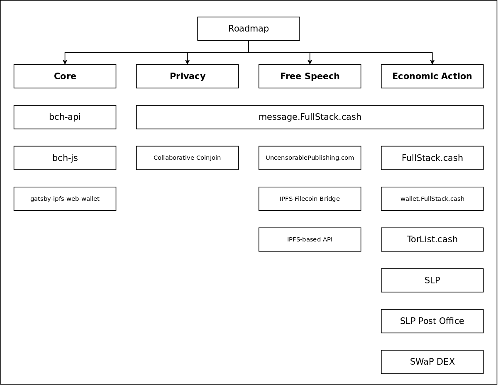

<iframe width="560" height="315" src="https://www.youtube.com/embed/69hSJOO_BFc" frameborder="0" allow="accelerometer; autoplay; clipboard-write; encrypted-media; gyroscope; picture-in-picture" allowfullscreen></iframe>

The PSF had it's [first Community Committee (CommComm) meeting](https://youtu.be/69hSJOO_BFc) this week. One of the 'broad stroke' ideas that has been resonating with the community is the idea of cross-blockchain technology. Many businesses want to leverage blockchain technology, without exposing themselves to the risk of any one blockchain.

This post lists the existing software under the care of the Permissionless Software Foundation. While the focus to-date of this software has been on the Bitcoin Cash (BCH) blockchain, it now also works on the Bitcoin ABC (BCHA) blockchain, and could be expanded to work on the Avalanch (AVAX) and Bitcoin SV (BSV) blockchains. It will all depend on the efforts put forth by developers interested in those chains.

This post is a first attempt at putting together a technical roadmap for the PSF. It's inspired by the [Bitcoin ABC roadmap](https://hub.textile.io/ipfs/bafkreibv46iwbjvg2cheysjehoznpr5bekilt4hozrl5xhflu6pjrz2774). On the left of the PSF roadmap is the 'Core' software described in the [scope of the Technical Steering Committee](https://github.com/Permissionless-Software-Foundation/TSC#psf-core). The right three columns reflect the three focal points in the [Mission of the PSF](https://psfoundation.cash/biz-plan/business-plan#mission):
- Privacy
- Free Speech
- Economic Action

The purpose of this 'rough draft' is to encourage discussion in our [general Telgram channel](https://t.me/permissionless_software) and our [VIP Telegram channel](https://t.me/psf_vip), and to provide food for thought in our first, upcoming [Technical Steering Committee meeting](https://github.com/Permissionless-Software-Foundation/community-committee/issues/3).

## Repositories Maintained by the PSF
The roadmap above reflects the existing and future software maintained by the PSF. Below are links to the code repositories represented in the picture. All the code under the PSF is open source and MIT licensed, allowing businesses to fork and customize any of it for their needs.

### Core
The 'core' software make up the top three layers of the [Cash Stack](https://fullstack.cash/static/cash-stack-poster-65d08f540f8ae1b175846270c9266ead.png). They are what allow modern phone and web apps to interact with a blockchain, for business applications. The other columns of the roadmap depend on, and build on top of, this core software.

- [gatsby-ipfs-web-wallet](https://github.com/Permissionless-Software-Foundation/gatsby-ipfs-web-wallet) - a [GatsbyJS Theme](https://www.gatsbyjs.com/docs/themes/) for building mobile-first web apps that incorporate basic wallet functionality.

  - [docker-gatsby-webserver](https://github.com/christroutner/docker-gatsby-webserver) is designed to serve a modern Gatsby website and web-apps over the clear web, Tor, and IPFS network simultaneously. Each network can be selectively turned off too. e.g. a website could be served over just Tor, with IPFS and the clear web turned 'off'.  

  - [bch-wallet-starter](https://github.com/Permissionless-Software-Foundation/bch-wallet-starter) is a [Gatsby Starter](https://www.gatsbyjs.com/docs/creating-a-starter/) based on gatsby-ipfs-web-wallet Gatsby Theme. This code base demonstrates how to combine the Theme with Plugins to build a customized business application.  

  - [gatsby-plugin-bch-sweep](https://github.com/Permissionless-Software-Foundation/gatsby-plugin-bch-sweep) is a [Gatsby Plugin](https://www.gatsbyjs.com/docs/plugins/) that can be added to a website utilizing gatsby-ipfs-web-wallet, to sweep BCH, BCHA, and SLP tokens from a paper wallet. It also demonstrates how to build Plugins for web wallets.

- [bch-js](https://github.com/Permissionless-Software-Foundation/bch-js) - a JavaScript library that provides tools for builing front end and back end applications for interacting with a blockchain.  

- [bch-api](https://github.com/Permissionless-Software-Foundation/bch-api) - a REST API for wrapping blockchain infrastructure like indexers and full nodes. This provides one *common* interface for application developers to work with, abstracting away any specific knowledge about the underlying infrastructure, and allowing them to focus on what they do best: build applications. This code base provides a REST API for communicating with the infrastructure listed below.

  - The [Cash Strap](https://fullstack.cash/cashstrap/) page lists the Docker containers below, as well as pre-synced databases that can be easily downloaded and mounted by those Docker containers. This allows businesses and developers to quickly bootstrap the infrastructure necessary to build their own, independent Cash Stack.  

  - [docker-slpdb](https://github.com/christroutner/docker-slpdb) - The SLPDB indexer used for indexing SLP tokens on the BCH and BCHA networks. This indexer could also be modified to track SLP tokens on BSV and AVAX blockchains.  

  - [docker-fulcrum](https://github.com/christroutner/docker-fulcrum) - The Fulcrum indexer that utilizes the Electrumx protocol. This is the server that run Electron Cash and Electrum ABC wallets. This indexer is used to track address balances and UTXOs, which is fundamental information needed to build a wallet.  

  - [docker-abc](https://github.com/christroutner/docker-abc) - The Bitcoin ABC full node needed to interact with the BCHA blockchain.  

  - [docker-bchn](https://github.com/christroutner/docker-bchn) - The BCHN full node needed to interact with the BCH blockchain.  

  - [docker-bchd](https://github.com/christroutner/docker-bchd) - The 'developer-centric' BCH full node that contains an integrated UTXO indexer, SLP indexer, and gRPC interface.  

## Privacy
- [Message.FullStack.cash](https://message.fullstack.cash) - This web app was originally created to allow people to send nearly-uncensorable, end-to-end encrypted (ee2e) messages (similar to email) to any Bitcoin Cash address. It's grown into a community gateway, IPFS file upload tool, and essential business communication tool.  

- [Collaborative CoinJoin](https://github.com/Permissionless-Software-Foundation/specifications/blob/master/ps004-collaborative-coinjoin.md) is a protocol specification for allowing HD wallets, like [slp-cli-walllet](https://github.com/Permissionless-Software-Foundation/slp-cli-wallet), to coordinate and generate CoinJoin transactions. These transactions anonymize coins and give users financial privacy.

## Free Speech
- [UncensorablePublishing.com](https://uncensorablepublishing.com) is an introductory site to uncensorable publishing techniques, how governments censor websites, and how to use PSF software to build private and uncensorable web apps.  

- **IPFS-Filecoin Bridge** - The initial steps for this bridge can be found on [message.FullStack.cash](https://message.fullstack.cash), in the File Upload area. Anyone can pay a hosting fee of $0.01 to have a file hosted on the IPFS network. This feature can be expanded for Filecoin.

- [IPFS-based API](https://youtu.be/VVc0VbOD4co) - This milestone is in its initial research stages. IPFS is an effective network for circumventing aggressive firewalls, like that of China's. The front end for [wallet.FullStack.cash](https://wallet.fulstack.cash) is already available over IPFS, but the back end REST API is not, and can be blocked. An IPFS pub-sub channel with Bitcoin-based end-to-end encryption wou be a secure, uncensorable way deliver API access and ensure that any web app can reach the blockchain.

## Economic Action
- [FullStack.cash](https://fullstack.cash) is a blockchain-as-a-service REST API that developers and businesses can use to power their business applications.  

- [wallet.FullStack.cash](https://wallet.fullstack.cash) is a white-label web wallet that businesses can customize to quickly build their own, custom applications. This wallet is based on the *gatsby-ipfs-web-wallet* Gatsby Theme.  

- [TorList.cash](https://torlist.cash) is a decentralized database of websites. Akin to a pre-search-engine curated list. Websites running over Tor and IPFS are placed on equal footing with clearnet websites. Websites ranking in each category is based on staked PSF tokens, inceasing demand for the token. The IPFS-based database is easily replicated, to prevent censorship.  

- The [SLP Token protocol](https://github.com/simpleledger/slp-specifications/blob/master/slp-token-type-1.md) is a simple structure for implementing tokens on top of a blockchain. [SLPDB](https://github.com/christroutner/docker-slpdb) is an indexer that crawls the blockchain and tracks the creation and movement of tokens. Tokens are a powerful tool for economic action.  

- The [SLP Post Office Protocol](https://youtu.be/IATkQEdRdVI) allows SLP tokens to be used natively, without exposing users to the friction of needed 'gas' to move tokens. The same SLP token can be used to pay the transaction fees. This makes it much easier to onboard new users. The PSF maintains a [Post Office Server](https://github.com/Permissionless-Software-Foundation/simpleledger-post-office-server) and a [Post Office Plugin](https://github.com/Permissionless-Software-Foundation/bch-wallet-plugin-postoffice) for the web wallet.  

- [SWaP Protocol](https://youtu.be/jypfYJkdJ1k) is a trustless way of creating a decentralized exchange (DEX) for trading SLP tokens and native assets (like BCH, BCHA, etc), making bets, establishing trustless escrow, and more. The PSF would like to develop tools around this protocol to enable more economic action using tokens.
