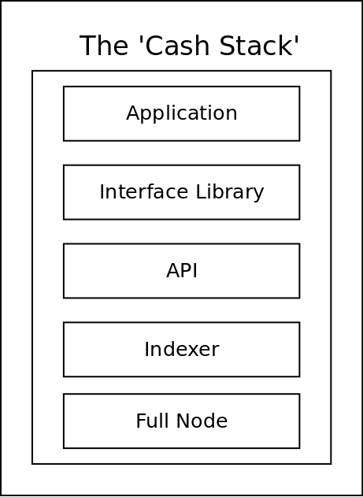

The 'Cash Stack' is a conceptual framework, inspired by the [OSI model](https://www.bmc.com/blogs/osi-model-7-layers/). It helps software developers discuss technical issues, by framing the conversation with regard to 'which layer in the stack' any one particular issue lives. This makes it easier to isolate (and ultimately fix) networking issues.

This model applies to all blockchain-based applications, regardless of the specific blockchain used. This model applies to BTC, BCH, BCHA, BSV, ETH, and AVAX.

The Cash Stack was originally conceived to help communicate the software layers used by [FullStack.cash](https://fullstack.cash) and [developer.bitcoin.com](https://developer.bitcoin.com), to show how software developers can use it to build apps on the Bitcoin Cash (BCH) blockchain. But when abstracted as above, the same conceptual framework applies to all blockchains.

This is a more specific implementation of the Cash Stack that is used by [FullStack.cash](https://fullstack.cash) for working with the Bitcoin Cash (BCH) and Bitcoin Cash ABC (BCHA) blockchains:

## The Role of the PSF
The mission of the Permissionless Software Foundation is to develop, promote, and maintain software that makes it easy for **individuals** to protect their privacy, circumvent censorship, and engage in economic activity. The 'Cash Stack' is the core technology used by the PSF to achieve it's mission.

The PSF maintains software for every level of the Cash Stack, for the BCH and BCHA blockchains. We hope to expand the infrastructure under our care to the AVAX and BSV blockchains one day too. In this way, we can build blockchain-agnostic tools, empowering businesses to use the blockchains with the best features (for them), and to mitigate the risk of blockchain 'lock in'.

The unique token-economic model used by the PSF serves to maintain the Cash Stack code and infrastructure. Businesses and users consume the token directly, or through use of the PSF software, and the token pays for ongoing maintenance of the Cash Stack software.

The following sections point out the code repositories that make up the PSF implementations of the Cash Stack.

## Full Nodes
A full node is the most fundamental building block of a blockchain-based application. It's the software that writes data to the blockchain and communicates with the network.

Docker containers are heavily used to run Cash Stack infrastructure. Syncing a full node or indexer from 'genesis' is a very long, computationally expensive process. These Docker containers, maintained by the PSF, are designed to mount a pre-synced database that can be downloaded from the [Cash Strap page](https://fullstack.cash/cashstrap). This allows businesses to quickly stand-up their own, independent infrastructure. As an alternative, [FullStack.cash](https://fullstack.cash) provides quick access to the REST API layer, so that businesses do not need to maintain their own infrastructure.

- [docker-abc](https://github.com/Permissionless-Software-Foundation/docker-abc) runs a [Bitcoin ABC](https://www.bitcoinabc.org/) full node on the BCHA blockchain.  

- [docker-bchn](https://github.com/Permissionless-Software-Foundation/docker-bchn) runs a [BCHN full node](https://bitcoincashnode.org/) on the BCH blockchain.  

- [docker-bchd](https://github.com/Permissionless-Software-Foundation/docker-bchd) runs a [BCHD full node](https://bchd.cash/) on the BCH blockchain.

## Indexers
Indexers are like small search engines that crawl blockchain data by querying the full node. Different indexers do different things, but primarily they are concerned with tracking address balances and [UTXOs](http://zh.thedev.id/mastering-bitcoin-cash/4-transactions.html). In the case of SLP tokens, the SLPDB indexer tracks and validates SLP tokens.

- [docker-fulcrum](https://github.com/Permissionless-Software-Foundation/docker-fulcrum) runs a Fulcrum indexer, which uses the Electrumx protocol. This is the most performant indexer for BCH and BCHA blockchains, for tracking address balances and UTXO information.  

- [docker-slpdb](https://github.com/Permissionless-Software-Foundation/docker-slpdb) runs an SLPDB instance for tracking SLP tokens and validating SLP transactions.

## APIs
The PSF maintains the [bch-api](https://github.com/Permissionless-Software-Foundation/bch-api) REST API server written in node.js JavaScript, using the Express.js framework. It's tuned to work on both the BCH and BCHA blockchains.

The advantage of using a REST API is that developers can study [one set of documentation](https://api.fullstack.cash/docs) to learn how to interact with the layers below. They do not need to know any specific information on how to operate a full node or an indexer. The REST API is all they need to know. Also, because REST APIs are language agnostic, developers can use any modern programming language to interact with the REST API.

## Interface Library
The primary 'interface library' maintained by PSF is [bch-js](https://github.com/Permissionless-Software-Foundation/bch-js), the JavaScript library for working with the BCH and BCHA blockchains. This gives JavaScript developers an easy way to work with bch-api REST API, but it also provides several handy tools like creating wallets and addresses, signing messages, converting address formats, and many other useful tools. [bch-js-examples repository](https://github.com/Permissionless-Software-Foundation/bch-js-examples) contains quick-start code examples for solving many common business problems with bch-js.

While bch-js provides a toolbox of primitives, other JavaScript libraries have been developed and maintained by the PSF to help businesses quickly solve several common use cases:

- [slp-cli-wallet](https://github.com/Permissionless-Software-Foundation/slp-cli-wallet) is a command-line, HD wallet with SLP token support. It does not have a graphical user interface, which makes it a great tool for rapid prototyping. Software developers can quickly build out a proof-of-concept for their ideas, to demonstrate it or share it with other developers. They can test it and try it out, without committing all the extra work of designing and building a graphical user interface.  

- [minimal-slp-wallet](https://github.com/Permissionless-Software-Foundation/minimal-slp-wallet) contains the most basic BCH and BCHA wallet functionality, with SLP token support. It's optimized for front end (web-browser-based) applications. If blockchain applications can be thought of as a composition of Legos, this is the first Lego piece that they would want to start with. It provides the basic wallet functionality to the gatsby-ipfs-web-wallet Gatsby Theme (described below).  

- [bch-util](https://github.com/Permissionless-Software-Foundation/bch-util) contains convenient utility functions, such as rounding a number to 2 or 8 decimal places, finding the biggest UTXO to spend, or hydrating a UTXO with SLP token information. This is a handy library for accomplishing common tasks.  

- [bch-message-lib](https://github.com/Permissionless-Software-Foundation/bch-message-lib) is focused on using blockchains as a communication medium. It leverages the [Memo protocol](https://memo.cash/protocol) and the [PS001 specification for message passing on the blockchain](https://github.com/Permissionless-Software-Foundation/specifications/blob/master/ps001-media-sharing.md).  

- [bch-encrypt-lib](https://github.com/Permissionless-Software-Foundation/bch-encrypt-lib) contains functions for implementing end-to-end encrypted (e2ee) messages using the Eliptic Curve cryptography that is native to the Bitcoin protocol. Any app can use this library to send e2ee messages that can only be read by a person holding the private key to a Bitcoin Cash address.

## Applications
**This is where the magic happens.** This is the final layer where the graphical user interface (UI) exists. This is all the user-facing code that runs in a web browser or a phone app. This video introduces the PSF tools for working with this layer:

<iframe width="560" height="315" src="https://www.youtube.com/embed/G7ptg7VIRnk" frameborder="0" allow="accelerometer; autoplay; clipboard-write; encrypted-media; gyroscope; picture-in-picture" allowfullscreen></iframe>

These are a few of the code repositories for working in the application library. This list is constantly growing.

- [bch-wallet-starter](https://github.com/Permissionless-Software-Foundation/bch-wallet-starter) is the [GatsbyJS Starter](https://www.gatsbyjs.com/docs/starters/) for quickly creating your own business application that can work with the BCH or BCHA blockchains. [Live demo](https://demo-wallet.fullstack.cash/)  

- [gatsby-ipfs-web-wallet](https://github.com/Permissionless-Software-Foundation/gatsby-ipfs-web-wallet) is the [GatsbyJS Theme](https://www.gatsbyjs.com/docs/themes/) used by bch-wallet-starter. This leverages the minimal-slp-wallet library described above. [Live demo](https://gatsby-ipfs-web-wallet.fullstack.cash/)  

- [gatsby-plugin-bch-sweep](https://github.com/Permissionless-Software-Foundation/gatsby-plugin-bch-sweep) is a [Gatsby Plugin](https://www.gatsbyjs.com/docs/plugins/) that enables sweeping BCH and SLP tokens from a paper wallet. This plugin is implemented in [wallet.FullStack.cash](https://wallet.fullstack.cash). There are several other plugins maintained by the PSF that add additional functionality to your application. Like Lego blocks, plugins can be added to (or removed from) an application, to quickly customize it for your business use case.

## Example Applications
The PSF maintains several custom applications utilizing the Cash Stack. These not only provide real-world examples of how the code is used, it also enables the PSF community to function and communicate.  

- [wallet.FullStack.cash](https://wallet.fullstack.cash) is our BCH and BCHA web wallet. This was created by adding the gatsby-plugin-bch-sweep plugin to the bch-wallet-starter. It provides basic wallet functionality.  

- [message.FullStack.cash](https://message.fullstack.cash) is the primary communication tool used by the PSF community. It allows sending of end-to-end encrypted (e2ee) messages, displays a community feed, and is the gateway to gaining access to the [PSF VIP Telegram channel](https://t.me/psf_vip).  

- [splitbch.com](https://splitbch.com) is a splitting tool that was created to help PSF community members split their coins and SLP tokens between the BCH and BCHA blockchains after the November 2020 chain split.  

- [TorList.cash](https://torlist.cash/) is a curated list of websites. It puts deep web, Tor, and IPFS sites on equal footing with clear web websites. Sites list themselves by staking PSF tokens. The list of sites is stored on a shared p2p, uncensorable database, allowing multiple curation services to collaborate on the same raw data, and prevent censorship by state actors.

## Bitcoin SV
While no support for the BSV blockchain exists yet, because it is a fork of the BCH blockchain, the software maintained by the PSF should *theoretically* work with very little modification. If developers want to adapt and maintain the Cash Stack for the BSV blockchain, or help bring SLP tokens to the BSV chain, they should join the [PSF Telegram channel](https://t.me/permissionless_software).

## AVAX
[Ava Labs](https://www.avalabs.org/) maintains their own suit of software that follows the same Cash Stack model. AVAX is a blockchain of blockchains, so it looks little different. They have three main blockchains: X-chain, P-chain, and C-chain. The X-chain is the one that operates most like Bitcoin.

- [AvalancheGo](https://github.com/ava-labs/avalanchego) is the full node for the AVAX network.  

- [Ortelius](https://github.com/ava-labs/ortelius) is the AVAX indexer for the X-chain.  

- [AvalancheJS](https://github.com/ava-labs/avalanchejs) is the JavaScript library that communicates directly with the full node and indexer. It does not go through a REST API.  

- [avalanche-wallet](https://github.com/ava-labs/avalanche-wallet) is an example of a web wallet application built using the above infrastructure.

The PSF would love to collaborate with developers from the AVAX network. Both organizations have expressed interest in developing a cross-chain protocol that would allow SLP tokens to be moved between networks. Please join the [PSF Telegram channel](https://t.me/permissionless_software) and signal your interest.

## Comments
Want to leave feedback or discuss this blog post? Please leave comments on this Member.cash thread:
- https://member.cash/p/f902a31fc4
